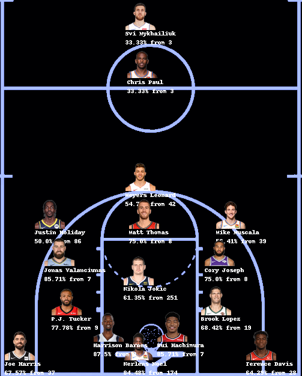

# nba-analysis
I found out that I can get a bunch of NBA data so I got excited and am playing around with it :-)

Notes:
+ Must have `Naked` installed for Python – `pip install Naked`

## Here's a fun pic of the FG% analysis:

